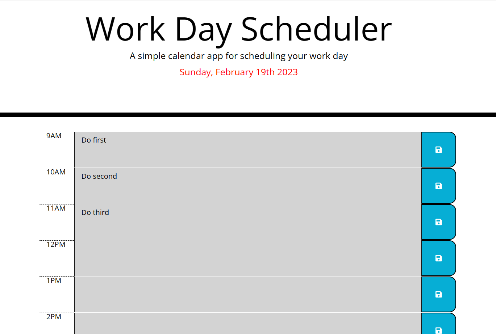

# Daily Planner App

  ## Description
  App helps a user to save important tasks and use timetable for current date. 
  Also persist events between refreshes of a page.

  ### Table of Contents
- [Installation](#installation)
- [Usage](#usage)
- [View](#view)
- [|Repository](#repository)

## Installation
Pull code from GitHub repo.

## Usage
Write tasks into text area and press button to save it.

## View
* Daily Planner App

## Repository
GitHub : [https://github.com/IraLototska/Daily-Planner-](https://github.com/IraLototska/Daily-Planner-) 

